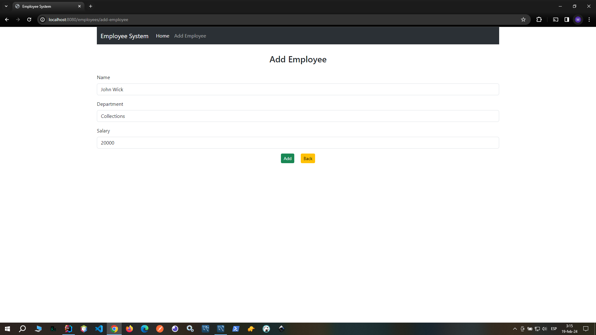
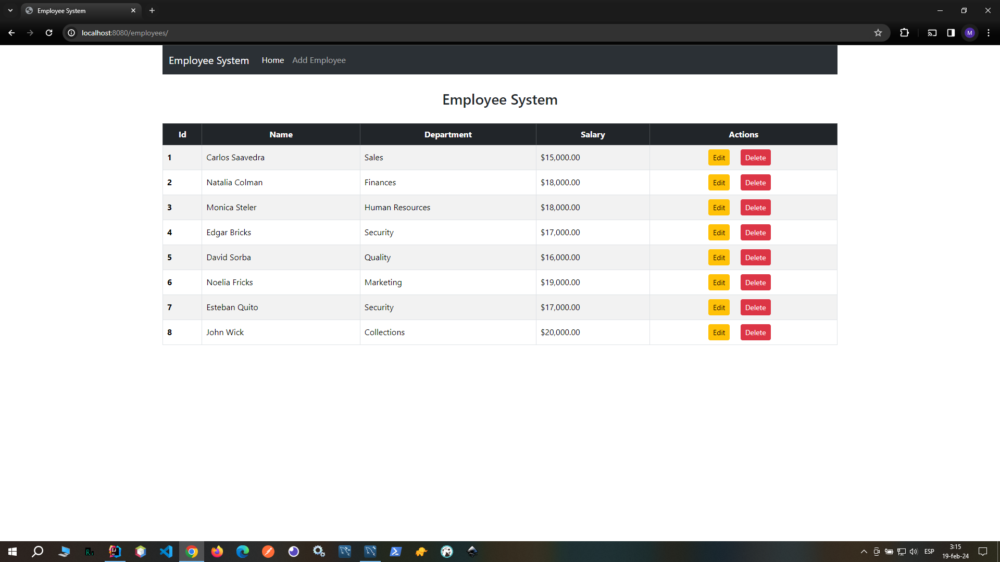
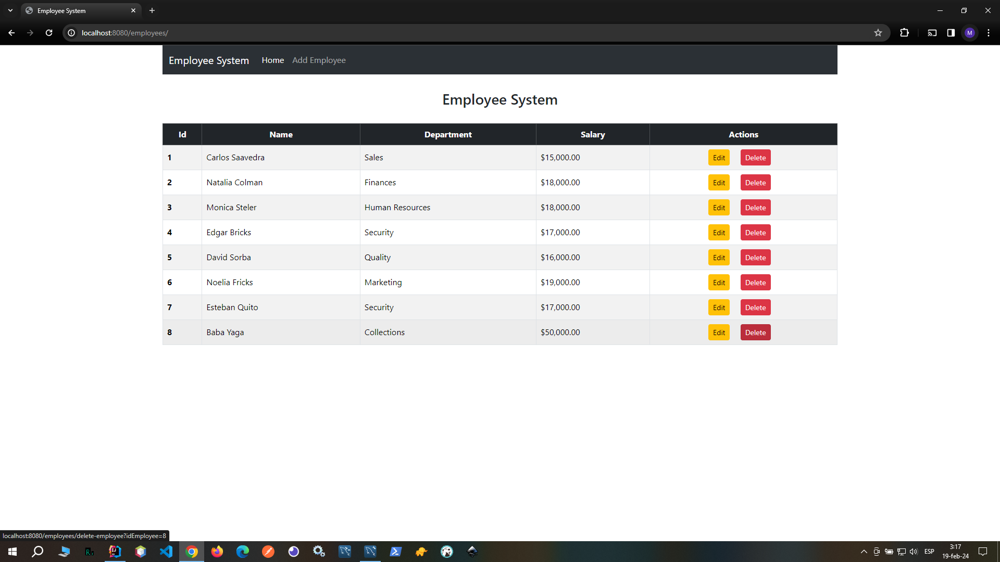
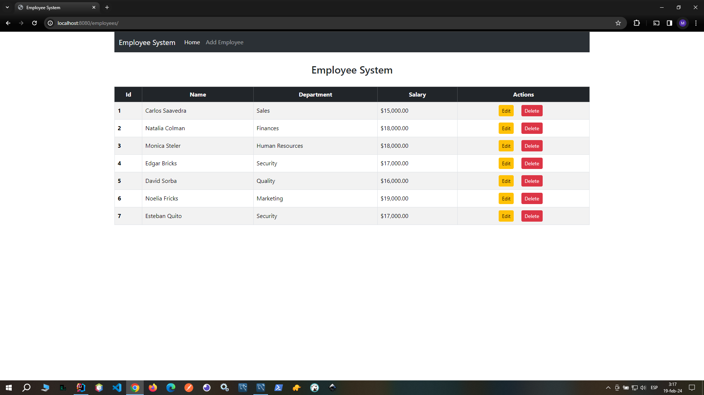

# Administración de Empleados

Este proyecto es una aplicación web para la administración de empleados, desarrollada utilizando JSP, Spring Data, MySQL y Bootstrap, implementado bajo el patrón de diseño MVC (Modelo-Vista-Controlador).

## Descripción

La aplicación de Administración de Empleados es una solución robusta para la gestión eficiente de la información de los empleados en una empresa. Permite realizar operaciones de registro, visualización, actualización y eliminación de empleados de manera sencilla y organizada.

- Haz clic en la imagen para ver un video de demostración del proyecto.

## Funcionalidades

- Visualización de detalles de empleados.
- Registro y gestión de empleados.
- Edición y actualización de información de empleados.
- Eliminación de empleados del sistema.

## Tecnologías Utilizadas

- **Java Server Pages (JSP):** Tecnología utilizada para crear páginas web dinámicas.
- **Spring Data:** Facilita la integración de aplicaciones Java con sistemas de bases de datos.
- **MySQL:** Sistema de gestión de bases de datos relacional utilizado para almacenar la información de los empleados.
- **Bootstrap:** Framework de código abierto para el desarrollo de interfaces web.

## Imágenes y Video de Demostración

- Imágenes de demostración del proyecto:

- Haz clic en la imagen para ver un video de demostración del proyecto.

